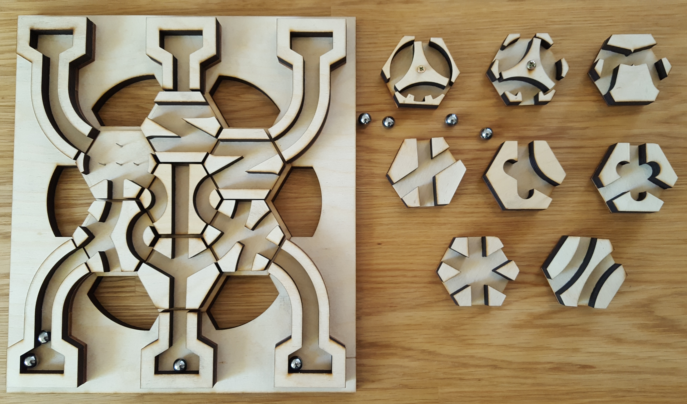

# Hex Tile Patterns

This is a collection of cutting patterns for laser cutting parts for wooden Hextraction tiles.
[Hextraction](https://www.playhextraction.com/) is an Open Source Board game by Zack Freedman usually intended to be 3D printed.

This project consist of python scripts which generate .svg files with the patterns needed for various tiles.
I mainly made these patterns for making some laser cut wooden Hextraction tiles, as opposed to 3D printing them.
As a result of that this, some of these scripts can be a bit chaotic.
So if you want to laser cut some of tiles too or otherwise mess around with this, here you go.

## What do I need to cut out

Files in Tiles/ are not intended to be cut directly those mainly serve as a preview and indicate what parts are needed and which thickness they need, while also serving as a hint for how those are put together.
For actually cutting them, those parts should be assembled into their seperate files.
The cutting patterns I had used were generated with TestBoard.py and TestCut.py.
However, what parts you need will depend on what tiles you want to get cut, so you will likely have to assembe your own and convert it to whatever format you need afterwards.

## Assembly

Since tiles can't be made in one piece, their seperate parts still need to be glued together with wood glue.
Tiles consist of one 50mm high and 3mm thick hexagonal plate ontop of which the 10mm thick parts for the tiles are glued.
From my experience it's easier to glue those one before glueing on the 3mm thick slightly smaller bottom plate with one to six indexing notches.
The Flipper tiles will need a screw and washers.
And for the Pachinko you can glue in some (1mm diameter) metal pins.

## Tiles

Current list of tiles that are included in this repository.

| Tile | Implemented In | Notes |
|:-----|:---------------|:------|
| Asterisk | Asterisk.py | |
| X | Asterisk.py | |
| Peace | Asterisk.py | |
| S | Asterisk.py | |
| Z | Asterisk.py | |
| 3Trap | Asterisk.py | More consistent at lower board angles |
| DIC | DIC.py | |
| DC | DIC.py | |
| XC | DIC.py | |
| Pisces | DIC.py | |
| 2Trap | TwoTrap.py | Very inconsistent, needs some rework |
| Flipper3 | Flipper.py | |
| Flipper6 | Flipper.py | |
| Pachinko | Flipper.py | |
| Newton | Newton.py | |
| QuadTrap | QuadTrap.py | Haven't made this yet, no clue if this works |
